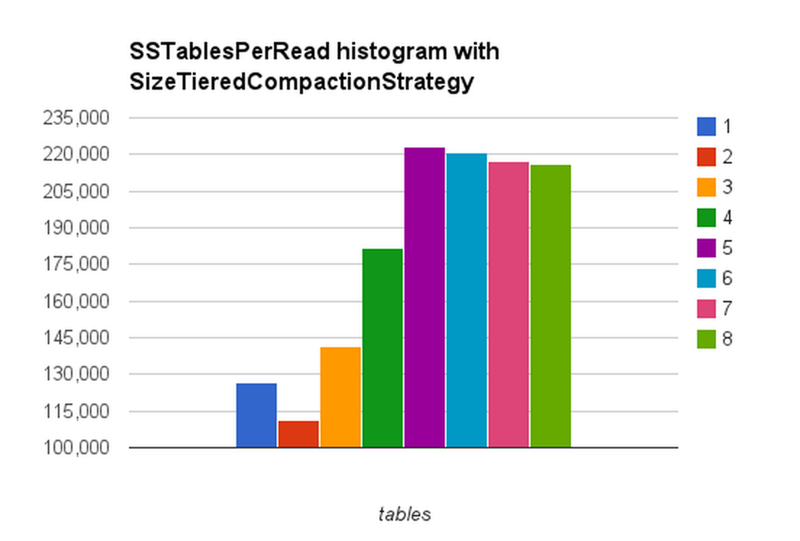

## Overall Architecture
---
In our personalization stack we are using [_Kafka_](http://kafka.apache.org/) for log collection, [_Storm_](https://storm.apache.org/) for real-time event processing, [_Crunch_](https://labs.spotify.com/2014/11/27/crunch/) for running batch map-reduce jobs on [_Hadoop_](http://hadoop.apache.org/) and [_Cassandra_](http://cassandra.apache.org/) to store user profile attributes and metadata about entities like playlists, artists, etc.

In the diagram below logs are forwarded by Kafka producers, running on different services and emitting different kinds of events like completion of a song and delivery of an ad impression, to the Kafka broker. There are 2 sets of Kafka consumers, subscribed to different topics, for consuming events:

- There are also other Crunch pipelines which ingest and generate metadata (genre, tempo, etc.) for different entities. These data records are stored in HDFS and also exported using  Crunch to Cassandra for real-time lookup in Storm pipelines. We will call the Cassandra cluster which stores entity metadata the Entity Metadata Store (EMS).

- The Storm pipelines process raw log events from Kafka, filter out unwanted events, decorate the entities with metadata fetched from EMS, group it per user and determine user level attributes by some algorithmic combination of aggregation and derivation. These user attributes when combined represent a user’s profile and they are stored in a Cassandra Cluster which we will call the User Profile Store (UPS).

![[img0.png]]
## Why is Cassandra a good fit ?
---
Since UPS is central to our personalization system, in this post we will elaborate why we chose Cassandra for storage. When we started shopping around for different storage solutions for UPS we desired a solution which could:

1. Scale horizontally
2.	Support replication – preferably cross-site
3.	Have low latency even at the cost of consistency since we aren’t performing  transactions
4.	Have the ability to load bulk and streaming data from Crunch and Storm respectively
5.	Have a decent ability to model different data schemas for different use-cases of entity metadata since we didn’t want to invest in yet another solution for EMS as that would have increased our operational cost.

## Horizontal scaling
---
Cassandra’s ability to scale with the number of nodes added to a cluster is highly advertised and has been [well documented already](http://techblog.netflix.com/2011/11/benchmarking-cassandra-scalability-on.html), so we were confident that it would be a good choice for our use case. Our project started with a relatively small size of data but has grown from a few GB to more than 100 GB today. Along the way, we’ve easily been able to expand our storage capacity by increasing the number of nodes in the cluster; for example we recently doubled the size of the cluster and observed that the latency (both at the median and 99th percentile) was nearly cut in half.

In addition, Cassandra’s replication and availability features have been a huge help. While we have unfortunately had a few cases of nodes crashing because of GC or hardware issues, our services accessing the Cassandra cluster were barely affected, since all of the data was available on other nodes and the client drivers are smart enough to transparently failover.

## Cross-site Replication
---
Spotify is available in nearly 60 countries across the globe. Our backend services run in two data centers in North America and two in Europe. To make sure that users could still be served by our personalization system in the event of failures in any one data center, it was very important for us to be able to store data in at least two of our data centers.

We are currently using the NetworkReplicationStrategy for our personalization clusters to replicate the data between the EU data center and NA data center. This allows users to access data in the Spotify data center nearest to them, and provides the redundancy capability as described above.

While we have not yet had any incidents that caused downtime of an entire cluster in an entire data center, we have performed several tests of migrating user traffic from one data center to another and our Cassandra setup has flawlessly handled the increase in traffic from handling requests from both sites in one site. 

## Low-latency operations and tunable consistency
---
Given Spotify’s user base, computing personalized data about user’s listening in real-time results in a large volume of data to store to a database. Beyond wanting queries to read this data to be fast, it was also important to us that the write path of storing data could also have very low latency.

Since [writes in Cassandra](http://www.datastax.com/documentation/cassandra/2.1/cassandra/dml/dml_write_path_c.html) result in storage in [an append-only structure](https://www.igvita.com/2012/02/06/sstable-and-log-structured-storage-leveldb/), writes are generally very fast. In fact in our usage of Cassandra for personalization, writes are typically an order of magnitude faster than reads.

Since the personalization data we compute in real-time is not transactional in nature, and lost data is easily replaced with new data in a few minutes from a user’s listening stream, we can tune [the consistency level](http://www.datastax.com/documentation/cassandra/2.1/cassandra/dml/dmlAboutDataConsistency.html) of our write and read operations to sacrifice consistency for even lower latency (by not waiting for all replicas to respond before having the operation succeed).

## Bulk Data Transfer
---
At Spotify we have a large investment in Hadoop and HDFS, and nearly all of our insights about users come from running jobs on historical data.

Cassandra offers [options for bulk importing data](http://www.datastax.com/documentation/cassandra/2.0/cassandra/tools/toolsBulkloader_t.html) from other data sources (such as HDFS) into the Cassandra cluster by building entire SSTables and then streaming the tables into the cluster. Streaming the tables into the cluster is much simpler, faster and more efficient than  sending millions or more of individual INSERT statements for all of the data you want to load into Cassandra.

Spotify has open-sourced a tool on-top of the bulk SSTable loaded named [hdfs2cass](https://github.com/spotify/hdfs2cass) for the specific use case of ingesting data from HDFS.

While the availability of this feature didn’t influence our decision to use Cassandra for personalization, it has made integrating our data from HDFS into Cassandra very easy and simple to operate.

# Our Cassandra data model
---
Our data model for personalization data in Cassandra has undergone a few evolutions since we have started on this project.

Initially, we thought we should simply have two column families – one for attributes (key-value pairs) for a user, and a similar set of attributes for “entities” (such as artists, tracks, playlists etc). The former would only contain short-lived data with TTLs, while the latter would be populated infrequently with relatively static data.

The motivation behind storing pairs of keys and values as individual CQL rows rather than attempting to create one CQL column for each “feature” (and having one CQL row per user) is to allow the services and batch jobs producing this data to be independent of the service consuming the data. With this approach, passing a new type of “feature” in this data from the producer all the way to the end-user does not require any changes in the consuming service, since that service is simply querying for all pairs for a given user.

These column families looked something like:

```cql
CREATE TABLE entitymetadata (
  entityid text,
  featurename text,
  featurevalue text,
  PRIMARY KEY (entityid, featurekey)
)

CREATE TABLE userprofilelatest (
  userid text,
  featurename text,
  featurevalue text,
  PRIMARY KEY (userid, featurename)
)
```

This structure worked fine for initial prototypes, but we soon ran into a few issues which necessitated a rethinking of the structure for the metadata about “entities”: 

1. The structure of the entitymetadata column meant that we could easily add new types of entitymetadata, but we could not remove data for certain featurenames if we experimented with a new type of data and found it was not useful and no longer needed.

2. For some types of metadata about entities, the data did not have natural string representation, but could be stored more easily using one of the CQL collection types. For instance, there were some cases where it felt more natural to represent the value as a `list<text>`, because the value was a list of things with an ordering that we wanted to maintain; or a `map<text, int>` for storing a ranking of values for an entity. 

```cql
CREATE TABLE playlisttag (
  entityid text,
  featurevalue list<text>,
  PRIMARY KEY (entityid)
)
```

Instead of a single column family with values that were keyed by (entityid, featurename), we adopted an approach of having one column family for each “featurename”, with the values using the appropriate CQL type. For instance:

Using the appropriate CQL type instead of a string-fits-all approach meant that we no longer had to make any awkward decisions about how to represent possibly-non-text-data as text (addressing point #2 above) and that we could easily drop column families for features that we added as an experiment but later decided were not useful. From an operational perspective this also allows us to inspect the number of read and write operations for each “feature”.

As of late 2014 we have close to a dozen column families for this type of data and have found it much easier to work with compared to trying to cram all pieces of data into a single representation.

The column family for user data underwent a similar evolution when the [DateTieredCompactionStrategy](https://labs.spotify.com/2014/12/18/date-tiered-compaction/) became available in Cassandra (which we are proud to say was a contribution to the Cassandra project from a fellow Spotify employee).

We were unhappy with the read and write latency to the _userprofilelatency_ column family and thought that DTCS might be a great fit for our use case since all of this data was timestamp-oriented and had short TTLs, so we experimented with changing from using STCS to DTCS for our “userprofilelatest” table to improve the latencies.

Before making any changes, we made note of the SSTablesPerRead histograms from _nodetool_ to have a “before” state to compare our changes against. A sample histogram from around this time looked like:

```
SSTables per Read
 1 sstables: 126733
 2 sstables: 111414
 3 sstables: 141385
 4 sstables: 181974
 5 sstables: 222921
 6 sstables: 220581
 7 sstables: 217314
 8 sstables: 216296
 10 sstables: 380294
```

> Note that not only is the histogram relatively flat, meaning that a large number of read requests need to touch many SSTables, but that the numbers actually increased as you go down the histogram.



We knew after examining the histograms that the latency was more-than-likely caused by the sheer number of SSTables that each read was going through, and that the key to reducing the latency would be in reducing the number of SSTables that had to be examined for each read.

Initially the results after enabling DTCS were not so promising, but this was caused not by any issues with the compaction strategy itself but by the fact that we had started to mix the short-lived TTL data in this column family with longer-lived “static” data for a user that had no TTL. 

To test if DTCS could better cope with rows with a TTL if all of the rows in the table had a TTL, we split this column family into two column families, one column family for the “static” rows that had no TTL and one columnfamily for rows with a TTL.

After carefully migrating the backend service that is a consumer of this data (by first changing the service to read from both the old and new columnfamily, and then reading only from the new columnfamily once it was fully populated), our experiment was a success: DTCS on the columnfamily with only TTLed rows yielded SSTablesPerRead histograms where the ratio of reads that needed to touch only 1 SSTable compared to 2 SStables was roughly between 6:1 and 12:1 (depending on the host).

An example output from _nodetool cfhistograms_ with this change:

```
SSTables per Read
 1 sstables: 4178514
 2 sstables: 302549
 3 sstables: 254760
 4 sstables: 197695
 5 sstables: 154961
 ...
```

or illustrated graphically:

![[img2.png]]

In attacking the latency issues we had with the userprofilelatest columnfamily, we learned a few valuable lessons about Cassandra:

1. DTCS is a great fit for time series, especially if the rows all have TTLs (and SizeTieredCompactionStrategy is a bad fit for this type of data)
    . But DTCS is not so great if you mix rows with TTLs and rows without TTLs, so don’t mix data in that way
    2. For tables with DTCS / TTL data we set gc_grace_period to 0 and effectively disable read repairs since we do not need them – the TTL is shorter than the grace period would be.
2. _nodetool cfhistograms_ and the number of SSTables-touched-per-read is probably the best resource for understanding why the latency numbers for a column family look the way they do, so make sure to frequently measure it and pipe it into your graphing system for observing changes over time.

With several tweaks to our data model and Cassandra configurations we’ve managed to build a robust storage layer for serving personalization data to multiple backend services. After fine-tuning the configurations we’ve incurred very little additional operational maintenance cost to keep our Cassandra clusters running. We’ve exposed a bunch of cluster and dataset specific metrics in a dashboard and set up alerts to fire if the metrics start trending in the wrong direction. This has helped us passively keep track of the cluster health. Other than doubling the size of our cluster to keep up with the additional load we haven’t had to deal a lot with cluster maintenance. Even the cluster doubling part was fairly easy and seamless and deserves another post to explain all the details.

We’ve overall been very satisfied with Cassandra as a solution for all our personalization needs and are confident to scale it up to serve personalized experience to our ever growing size of engaged user base.

Thanks to [PlanetCassandra](http://planetcassandra.org/blog/personalization-at-spotify-using-apache-cassandra/) for encouraging us to blog about our Cassandra experience.